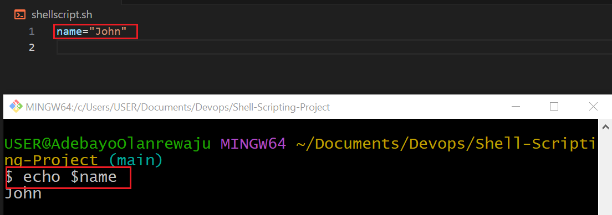
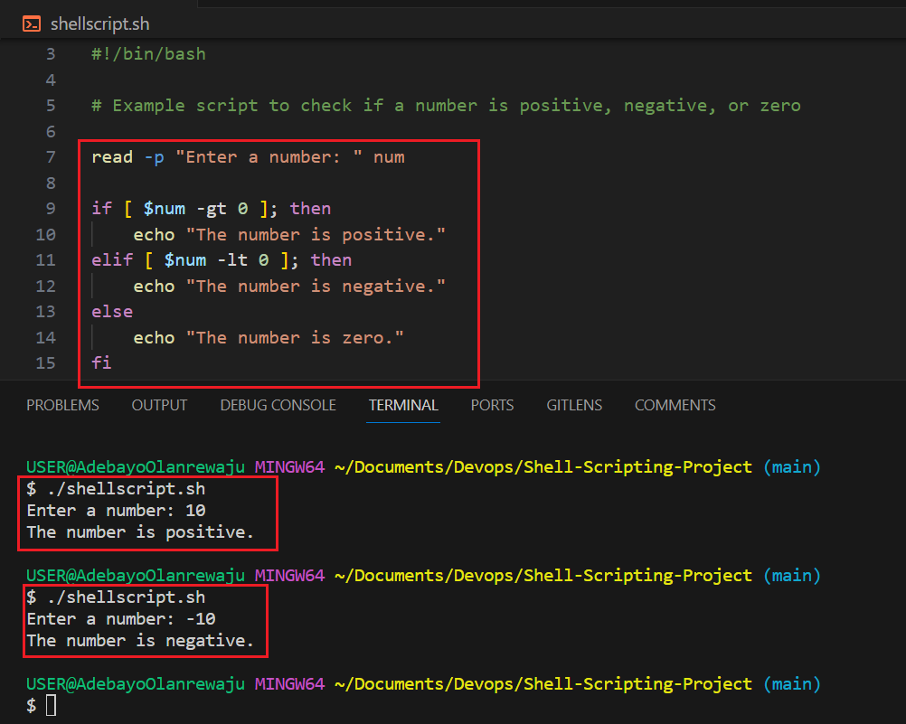
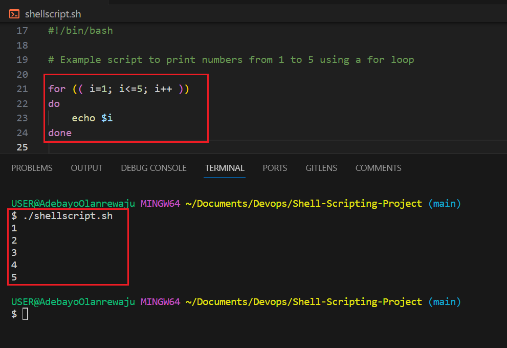
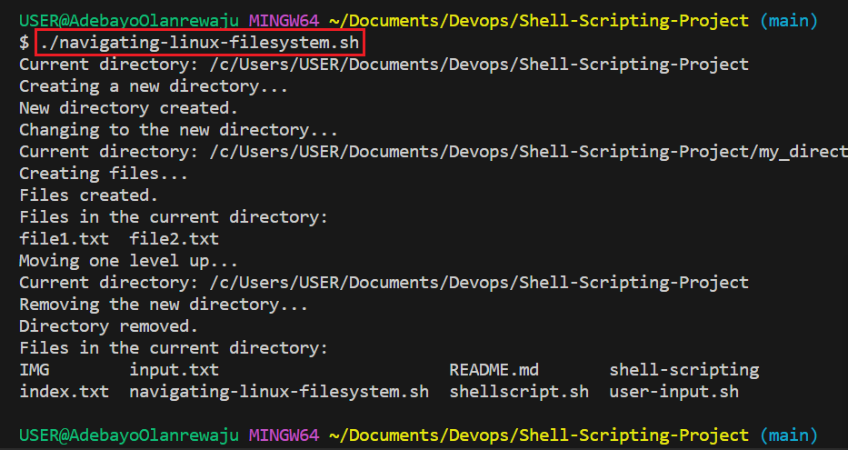

# Shell-Scripting-Project
displaying my shell scripting skills with a hands on project

Shell scripting is used to automate repetitive tasks. Bash scripts are essentially a series of commands and instructions that are executed sequentially in a shell. we create a shell script by saving a series of commands in a text file with a `.sh` extention. these scripts can be executed directly from the command line or called from other scripts.

## Shell Scripting Syntax Elements
Here we assign values to variables using the `=` operator, and access their values using the variable name preceeded by `$` sign. 

Bash also provides confrol flow statements like `if-else` for loops, while loops and case statements to control the flow of execution of your scripts as shown in the two examples below  
and 


## Running Scripts
To run a script on the terminal we first have to open a folder called *shell-scripting* using the command `mkdir shell-scripting` and then proceeed to create a file called *user-input* using the command `touch user-input` 

we then save the script below in the file 
```
{
#!/bin/bash

# Prompt the user for their name
echo "Enter your name:"
read name

# Display a greeting with the entered name
echo "Hello, $name! Nice to meet you."

}
```
to run the script we need to make the file executable by running the command `chmod +x user-input` 

### Directory Manipulation and Navigation
Here we will run scripts that will create a new directory, change to that directory and create two files inside it, list the files, move back one level up, remove the directory and its contents and finally list the in the directory again. To begin we will beging by creating a file named *navigating-linux-filesystem.sh* and making the file executable by running the following commands `touch navigating-linux-filesystem.sh` and `chmod +x navigating-linux-filesystem.sh` as shown below ) 

we then save the following script in the file created 
```
{
#!/bin/bash

# Display current directory
echo "Current directory: $PWD"

# Create a new directory
echo "Creating a new directory..."
mkdir my_directory
echo "New directory created."

# Change to the new directory
echo "Changing to the new directory..."
cd my_directory
echo "Current directory: $PWD"

# Create some files
echo "Creating files..."
touch file1.txt
touch file2.txt
echo "Files created."

# List the files in the current directory
echo "Files in the current directory:"
ls

# Move one level up
echo "Moving one level up..."
cd ..
echo "Current directory: $PWD"

# Remove the new directory and its contents
echo "Removing the new directory..."
rm -rf my_directory
echo "Directory removed."

# List the files in the current directory again
echo "Files in the current directory:"
ls

}
```
we then run the script by running the command `./navigating-linux-filesystem.sh` as shown below 

### File Operation and Sorting
Here we run a script that create three files, display the files in the current order, sort them alphabetically, saves the sorted files in sorted files.txt, displays the sorted files, removes the original files, renames the sorted file to sorted_files_sorted_alphabetically.txt and finally display the content of the final sorted file. 

To begin we will beging by creating a file named *sorting.sh* and making the file executable by running the following commands `touch sorting.sh` and `chmod +x sorting.sh` as shown below ) 
we then save the following script in the file created 
```
{
#!/bin/bash

# Create three files
echo "Creating files..."
echo "This is file3." > file3.txt
echo "This is file1." > file1.txt
echo "This is file2." > file2.txt
echo "Files created."

# Display the files in their current order
echo "Files in their current order:"
ls

# Sort the files alphabetically
echo "Sorting files alphabetically..."
ls | sort > sorted_files.txt
echo "Files sorted."

# Display the sorted files
echo "Sorted files:"
cat sorted_files.txt

# Remove the original files
echo "Removing original files..."
rm file1.txt file2.txt file3.txt
echo "Original files removed."

# Rename the sorted file to a more descriptive name
echo "Renaming sorted file..."
mv sorted_files.txt sorted_files_sorted_alphabetically.txt
echo "File renamed."

# Display the final sorted file
echo "Final sorted file:"
cat sorted_files_sorted_alphabetically.txt

}
```
we then run the script by running the command `./sorting.sh` as shown below 

### Working with Numbers and Calculation
Here the following script defines two variables num1 and num2 with numeric values, performs basic arithemtic operations (addition, subtraction, multiplication, division, and modulus), and displays the results. it also performs more complex calculations such as raising num1 to the power of 2 and calculating square root of num2, and displays those results as well. 

To begin we will beging by creating a file named *calculations.sh* and making the file executable by running the following commands `touch calculations.sh` and `chmod +x calculations.sh` as shown below ) 
we then save the following script in the file created 
```
{
#!/bin/bash

# Define two variables with numeric values
num1=10
num2=5

# Perform basic arithmetic operations
sum=$((num1 + num2))
difference=$((num1 - num2))
product=$((num1 * num2))
quotient=$((num1 / num2))
remainder=$((num1 % num2))

# Display the results
echo "Number 1: $num1"
echo "Number 2: $num2"
echo "Sum: $sum"
echo "Difference: $difference"
echo "Product: $product"
echo "Quotient: $quotient"
echo "Remainder: $remainder"

# Perform some more complex calculations
power_of_2=$((num1 ** 2))
square_root=$(awk "BEGIN{ sqrt=$num2; print sqrt }")

# Display the results
echo "Number 1 raised to the power of 2: $power_of_2"
echo "Square root of number 2: $square_root"
}
```
we then run the script by running the command `./calculations.sh` as shown below 

### File Backup and Timestamping 
Here the following script defines the source directory and backup directory paths. It then creates a timestamp using the current date and time, and create a backup directory with the timestamp appended to its name. The script then copies all files from the source directory to the backup directory using the `cp` command with the `-r` option for recursive copying. Finally, it displays a message indicating the completion of the backup process and shows the path of the backup directory with the timestamp.

To begin we will beging by creating a file named *backup.sh* and making the file executable by running the following commands `touch backup.sh` and `chmod +x backup.sh` as shown below ) 
we then save the following script in the file created 

```
{
#!/bin/bash

# Define the source directory and backup directory
source_dir="/path/to/source_directory"
backup_dir="/path/to/backup_directory"

# Create a timestamp with the current date and time
timestamp=$(date +"%Y%m%d%H%M%S")

# Create a backup directory with the timestamp
backup_dir_with_timestamp="$backup_dir/backup_$timestamp"

# Create the backup directory
mkdir -p "$backup_dir_with_timestamp"

# Copy all files from the source directory to the backup directory
cp -r "$source_dir"/* "$backup_dir_with_timestamp"

# Display a message indicating the backup process is complete
echo "Backup completed. Files copied to: $backup_dir_with_timestamp"
}
```
we then run the script by running the command `./backup.sh` as shown below 


